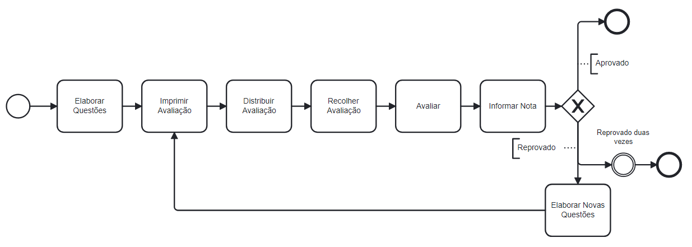
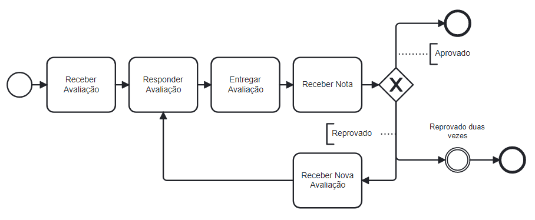
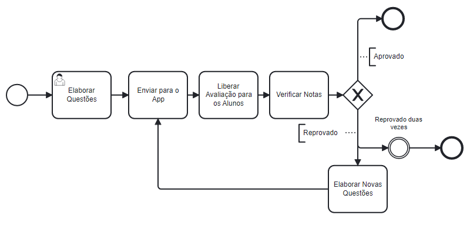
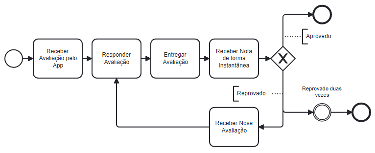
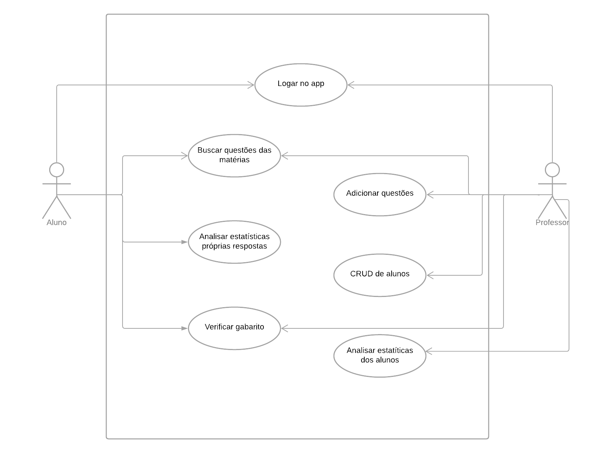
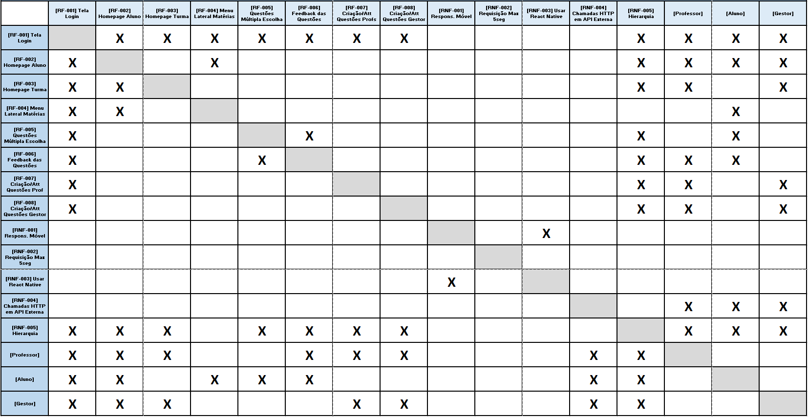
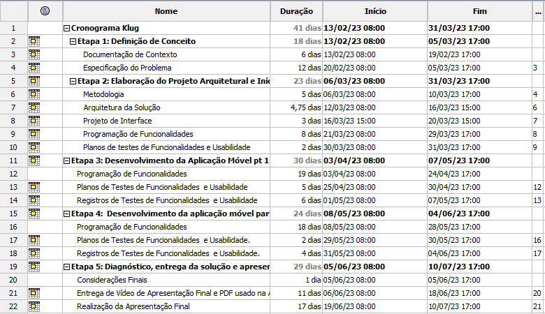
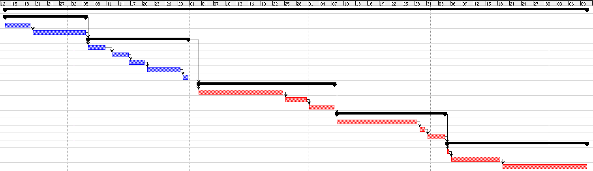
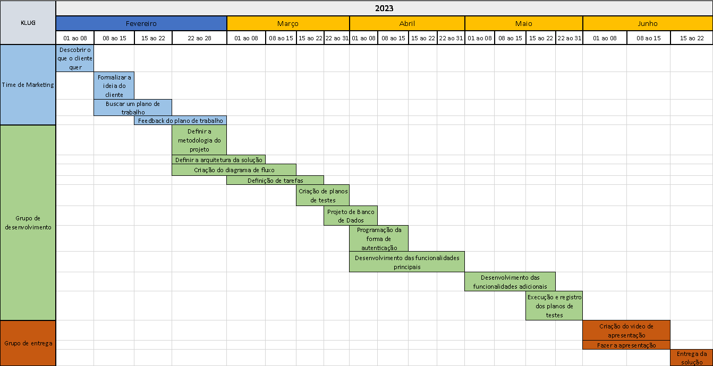
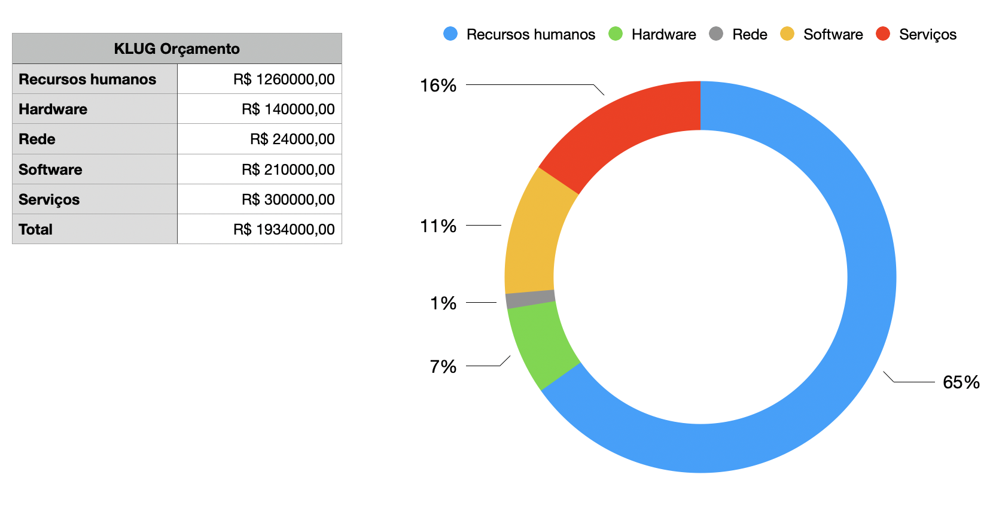

# Especificações do Projeto

Pré-requisitos: <a href="1-Documentação de Contexto.md"> Documentação de Contexto</a>

A seguir estão apresentadas as personas que foram encontradas durante a pesquisa de resolução e entendimento do problema.

## Personas

|                       Kali Habbab                        |                                   Idade:35                                    |                                                   Persona 1 - Professor                                                    |
| :------------------------------------------------------: | :---------------------------------------------------------------------------: | :------------------------------------------------------------------------------------------------------------------------: |
|       |                           **Ocupação:**  Professor.                           |                                  **Aplicativos:** Facebook, WhatsApp, YouTube, Instagram.                                  |
|                      **Motivações**                      |                                **Frustrações**                                |                                                   **Hobbies e História**                                                   |
|          Conseguir ensinar de forma eficiente.           | Fica cansado de ter que corrigir exercícios dos alunos de várias salas à mão. |                                                       Jogar Xadrez.                                                        |

|                      Julia Fonseca                       |                                   Idade:45                                    |                                                    Persona 2 - Pedagoga                                                    |
| :-----------------------------------------------------:  |    :---------------------------------------------------------------------:    |                             :---------------------------------------------------------------:                              |
|   |                     **Ocupação:**  Supervisora de escola.                     |                             **Aplicativos:**  Facebook, WhatsApp, YouTube, Instagram, Tinder.                              |
|                      **Motivações**                      |                                **Frustrações**                                |                                                   **Hobbies e História**                                                   |
|                Ser uma boa profissional.                 |    Está insatisfeita de ver que os métodos de ensino não serem melhorados.    |                                             Praticar exercícios e jogar vôlei.                                             |

|                    Ana Luíza Oliveira                    |                                   Idade: 14                                   |                                                   Persona 3 - Estudante                                                    |
| :------------------------------------------------------: |                  :-----------------------------------------:                  | :------------------------------------------------------------------------------------------------------------------------: |
|  |                           **Ocupação:** Estudante.                            |                                     **Aplicativos:** Instagram, YouTube, Tiktok, Kwai.                                     |
|                      **Motivações**                      |                                **Frustrações**                                |                                                   **Hobbies e História**                                                   |
|              Ser uma boa filha e boa aluna.              |                  Não encontra boas formas de fixar conteúdo.                  | Fica frustrada quando não consegue entender algo na escola e sente que está ficando para trás em relação aos seus colegas. |

|                      Enzo Valentim                       |                                   Idade: 12                                   |                                                     Persona 4 - Aluno                                                      |
| :-----------------------------------------------------:  |                        :-----------------------------:                        |                                     :-----------------------------------------------:                                      |
|   |                           **Ocupação:** Estudante.                            |                                     **Aplicativos:** Youtube, Instagram, Tiktok, Kwai                                      |
|                      **Motivações**                      |                                **Frustrações**                                |                                                   **Hobbies e História**                                                   |
|            Se divertir com família e amigos.             |                        Acha o ensino massante e chato.                        |                                     Jogar vídeo game, e praticar esportes com amigos.                                      |

## Histórias de Usuários

Registramos as histórias das personas encontradas para o projeto e analisamos suas histórias. 

| EU COMO... `PERSONA` | QUERO/PRECISO ... `FUNCIONALIDADE` | PARA ... `MOTIVO/VALOR`                |
| -------------------- | ---------------------------------- | -------------------------------------- |
|**Kali Habbab**| Quer que o processo de correção de exercícios seja mais eficiente. | Não levar tanto tempo corrigindo exercícios de todos os alunos manualmente.|
|**Julia Fonseca**| Quer que os métodos de ensino se atualizem. | Para que o processo de aprendizado se torne mais dinâmico. |
|**Ana Luíza Oliveira**| Quer uma maneira para fixar conteúdo. | Fica frustrada quando não consegue entender algo na escola e sente que está ficando para trás em relação aos seus colegas.|
|**Enzo Valentim**| Quer que o ensino fique menos chato, tendo métodos que usem tecnologia para ensino. | O ensino ficar mais didático e eficiente.|

## Modelagem do Processo de Negócio 

### Análise da Situação Atual

Atualmente a forma de realizar as atividades e provas na sala de aula é manual, inclusive a correção feita pelo professor. O processo de criação de uma prova é feita com a impressão da mesma, onde o professor entrega para o aluno uma folha, que escreve manualmente suas respostas e entrega ao final do prazo, para que o professor faça a correção. Com o trabalho em várias escolas e turmas, a demanda de tempo para correção de um professor é grande, o que inviabiliza a dispensação do tempo para a melhoria da didática no ensino dos conteúdos. 

### Descrição Geral da Proposta

A nossa proposta é viabilizar a aplicação automática de questões aos alunos, bem como a apuração dos acertos e erros dos mesmos.

### Processo 1 – Professor

Apresente aqui o nome e as oportunidades de melhorias para o processo 1. Em seguida, apresente o modelo do processo 1, descrito no padrão BPMN. 

### Processo 1 – Aluno

Apresente aqui o nome e as oportunidades de melhorias para o processo 1. Em seguida, apresente o modelo do processo 1, descrito no padrão BPMN. 

### Processo 2 – Professor

Apresente aqui o nome e as oportunidades de melhorias para o processo 2. Em seguida, apresente o modelo do processo 2, descrito no padrão BPMN.

### Processo 2 – Aluno

Apresente aqui o nome e as oportunidades de melhorias para o processo 2. Em seguida, apresente o modelo do processo 2, descrito no padrão BPMN.

## Indicadores de Desempenho

Os indicadores de desempenho são medição e avaliação dentro do fluxo, que ajudam a direcionar os processos e auxiliar as pessoas em relação aos objetivos e metas traçados no planejamento estratégico de um projeto.  

Usar o seguinte modelo: 

## Requisitos

As tabelas que se seguem apresentam os requisitos funcionais e não funcionais que detalham o escopo do projeto. Para determinar a prioridade de requisitos, aplicar uma técnica de priorização de requisitos e detalhar como a técnica foi aplicada.

### Requisitos Funcionais

|ID    | Descrição do Requisito  | Prioridade |
|------|-----------------------------------------|----|
|RF-001| Tela de Login | ALTA | 
|RF-002| Home Page com Estatísticas do Aluno | MÉDIA | 
|RF-003| Home Page com Estatísticas dos Alunos | ALTA | 
|RF-004| Menu Laterial com as Matérias Disponíveis | ALTA | 
|RF-005| Scroll com as Questões de Multipla Escolha | MÉDIA | 
|RF-006| Feedback da Resposta da Questão | MÉDIA | 
|RF-007| CRUD Questões para Professores | ALTA | 

### Requisitos não Funcionais

|ID     | Descrição do Requisito  |Prioridade |
|-------|-------------------------|----|
|RNF-001| O sistema deve ser responsivo para rodar em um dispositivos móvel | MÉDIA | 
|RNF-002| Deve processar requisições do usuário em no máximo 5s |  BAIXA | 
|RNF-003| Deve ser Desenvolvido usando React Native |  ALTA | 
|RNF-004| Deve usar chamadas HTTP em uma API externa |  MÉDIA | 
|RNF-005| Deve impedir que os usuários de hierarquia superior possam interferir na apuração do resultado dos alunos |  ALTA | 

<!--
Com base nas Histórias de Usuário, enumere os requisitos da sua solução. Classifique esses requisitos em dois grupos:

- [Requisitos Funcionais
 (RF)](https://pt.wikipedia.org/wiki/Requisito_funcional):
 correspondem a uma funcionalidade que deve estar presente na
  plataforma (ex: cadastro de usuário).
- [Requisitos Não Funcionais
  (RNF)](https://pt.wikipedia.org/wiki/Requisito_n%C3%A3o_funcional):
  correspondem a uma característica técnica, seja de usabilidade,
  desempenho, confiabilidade, segurança ou outro (ex: suporte a
  dispositivos iOS e Android).
Lembre-se que cada requisito deve corresponder à uma e somente uma
característica alvo da sua solução. Além disso, certifique-se de que
todos os aspectos capturados nas Histórias de Usuário foram cobertos.
-->

## Restrições

O projeto está restrito pelos itens apresentados na tabela a seguir.

|ID| Restrição                                             |
|--|-------------------------------------------------------|
|01| O projeto deverá ser entregue até o final do semestre |
|02| Não pode ser desenvolvido um módulo de backend        |

Enumere as restrições à sua solução. Lembre-se de que as restrições geralmente limitam a solução candidata.

> **Links Úteis**:
> - [O que são Requisitos Funcionais e Requisitos Não Funcionais?](https://codificar.com.br/requisitos-funcionais-nao-funcionais/)
> - [O que são requisitos funcionais e requisitos não funcionais?](https://analisederequisitos.com.br/requisitos-funcionais-e-requisitos-nao-funcionais-o-que-sao/)

## Diagrama de Casos de Uso

O diagrama de casos de uso é o próximo passo após a elicitação de requisitos, que utiliza um modelo gráfico e uma tabela com as descrições sucintas dos casos de uso e dos atores. Ele contempla a fronteira do sistema e o detalhamento dos requisitos funcionais com a indicação dos atores, casos de uso e seus relacionamentos. 

<!--
As referências abaixo irão auxiliá-lo na geração do artefato “Diagrama de Casos de Uso”.

> **Links Úteis**:
> - [Criando Casos de Uso](https://www.ibm.com/docs/pt-br/elm/6.0?topic=requirements-creating-use-cases)
> - [Como Criar Diagrama de Caso de Uso: Tutorial Passo a Passo](https://gitmind.com/pt/fazer-diagrama-de-caso-uso.html/)
> - [Lucidchart](https://www.lucidchart.com/)
> - [Astah](https://astah.net/)
> - [Diagrams](https://app.diagrams.net/)
-->

# Matriz de Rastreabilidade

A matriz de rastreabilidade é uma ferramenta usada para facilitar a visualização dos relacionamento entre requisitos e outros artefatos ou objetos, permitindo a rastreabilidade entre os requisitos e os objetivos de negócio. 

A matriz deve contemplar todos os elementos relevantes que fazem parte do sistema, conforme a figura meramente ilustrativa apresentada a seguir.

<!--
> **Links Úteis**:
> - [Artigo Engenharia de Software 13 - Rastreabilidade](https://www.devmedia.com.br/artigo-engenharia-de-software-13-rastreabilidade/12822/)
> - [Verificação da rastreabilidade de requisitos usando a integração do IBM Rational RequisitePro e do IBM ClearQuest Test Manager](https://developer.ibm.com/br/tutorials/requirementstraceabilityverificationusingrrpandcctm/)
> - [IBM Engineering Lifecycle Optimization – Publishing](https://www.ibm.com/br-pt/products/engineering-lifecycle-optimization/publishing/)
-->

# Gerenciamento de Projeto

De acordo com o PMBoK v6 as dez áreas que constituem os pilares para gerenciar projetos, e que caracterizam a multidisciplinaridade envolvida, são: Integração, Escopo, Cronograma (Tempo), Custos, Qualidade, Recursos, Comunicações, Riscos, Aquisições, Partes Interessadas. Para desenvolver projetos um profissional deve se preocupar em gerenciar todas essas dez áreas. Elas se complementam e se relacionam, de tal forma que não se deve apenas examinar uma área de forma estanque. É preciso considerar, por exemplo, que as áreas de Escopo, Cronograma e Custos estão muito relacionadas. Assim, se eu amplio o escopo de um projeto eu posso afetar seu cronograma e seus custos.

## Gerenciamento de Tempo

Com diagramas bem organizados que permitem gerenciar o tempo nos projetos, o gerente de projetos agenda e coordena tarefas dentro de um projeto para estimar o tempo necessário de conclusão.

Diagrama de Gantt também é uma ferramenta visual utilizada para controlar e gerenciar o cronograma de atividades de um projeto. Com ele, é possível listar tudo que precisa ser feito para colocar o projeto em prática, dividir em atividades e estimar o tempo necessário para executá-las.

## Gerenciamento de Equipe

O gerenciamento adequado de tarefas contribuirá para que o projeto alcance altos níveis de produtividade. Por isso, é fundamental que ocorra a gestão de tarefas e de pessoas, de modo que os times envolvidos no projeto possam ser facilmente gerenciados. 

## Gestão de Orçamento

O orçamento do projeto foi dividido em cinco partes: Recursos humanos, hardware, rede, software e serviços.

Em recursos humanos consideramos uma equipe formada por sete membros, onde cada um possui um custo de aproximadamente R$30.000/mês. Em seis meses, o custo total dos sete funcionários seria de R$1.260.000.

Em hardware consideramos um notebook e alguns periféricos, como mouse e teclado, para cada um. Nesse caso, teríamos um custo fixo de R$20000 por funcionário, dando um total de R$140.000.

Em rede consideramos toda estrutura de rede interna do escritório, considerando internet e intranet. O custo ficaria em torno de R$3000/mês, totalizando ao final R$24.000.

Em software consideramos todas as ferramentas utilizadas pela equipe para trabalhar, como IDE, MS Teams... O custo total dessas ferramentas para cada funcionário é de R$5.000/mês, totalizando ao final do projeto R$210.000.

Em serviços podemos considerar tanto os que estão a disposição do funcionário, quanto a disposição do cliente e do projeto. Nesse caso, serviços para escritório, como limpeza, café, água, ou serviços como azure, estão inclusos. Teremos um custo aproximado de R$50.000/mês, totalizando R$300.000.

