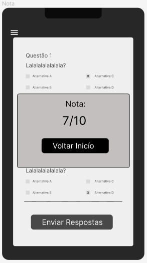

# Template Padrão da Aplicação

#### Login

Tela de acesso ao aplicativo com e-mail e senha definidos na hora do cadastro. 

#### Cadastro

Tela em que o usuário vai cadastrar seus dados para acessar o aplicativo, colocando e-mail e senha e definindo se ele é aluno ou professor.

#### Recuperar Senha

Tela para o caso de esquecimento de senha. Usuário deverá colocar o e-mail informado no cadastro para receber uma nova senha. 

### Professor

#### Estatisticas da Turma - HOME PAGE
Nessa tela o professor terá acesso às estatísticas dos alunos, segundo as avaliações que eles concluíram.

#### Menu 
Tela que contém a criação de novas atividades e a verificação de atividades já publicadas

#### Criar Nova Atividade + Revisar e Publicar Questões

Ao clicar no ícone de mais, o professor pode criar uma nova atividade, adicionando questões. Ele também tem a opção de editar ou apagar questões já criadas. Ao criar uma nova questão, um pop-up exibe o valor da questão a ser atribuída.

#### Pop-up do Valor da Questão a Ser Criada

Contém um 'input' para preenchimento do valor da questão.

#### Pop-up de Atividade Publicada

Mensagem: A atividade já está disponível para ser realizada pelos alunos. 

#### Verfificar Atividades 

O professor pode verificar o status das atividades já publicadas, que podem estar com os seguintes status: Encerrada, Em andamento ou Aberta. Essa opção permite ao professor acompanhar o progresso dos alunos nas atividades.

#### Perfil do Professor 

Contém o nome do professor e o botão para sair e desconectar do aplicativo.

### Aluno

#### Estatisticas do Aluno - HOME PAGE

Homepage com todas as estatísticas das atividades já realizadas pelo aluno.

#### Menu

Contém as atividades já avaliadas e as atividades que os professores disponibilizaram para serem realizadas pelos alunos.

#### Lista de Atividades Avaliadas

Contém as atividades que foram avaliadas pelo professor de todas as matérias. Os alunos podem visualizar suas notas.

#### Lista de Atividades Publicadas

Contém as atividades que os professores disponibilizaram recentemente para serem realizadas pelos alunos. Os alunos podem acessar e responder às questões das atividades.

#### Questões

Permite aos alunos visualizarem as questões de uma atividade específica para responderem.

#### Enviar Questões

Após realizar uma atividade, os alunos podem responder às questões e enviá-las para que o professor possa avaliar.

#### Nota do Aluno

Após clicar no botão "Enviar" para enviar as respostas da atividade, um pop-up exibirá a nota do aluno.

 

#### Perfil do Aluno 

Contém o nome do aluno e o botão para sair e desconectar do aplicativo.

