# Registro de Testes de Software

Pré-requisitos: <a href="3-Projeto de Interface.md"> Projeto de Interface</a>, <a href="8-Plano de Testes de Software.md"> Plano de Testes de Software</a>

Relatório com as evidências dos testes de software realizados no sistema pela equipe, baseado em um plano de testes pré-definido.

## CT-01 – Tela de login

O objetivo do teste CT-01 é conectar ao perfil do usuário no sistema. 

>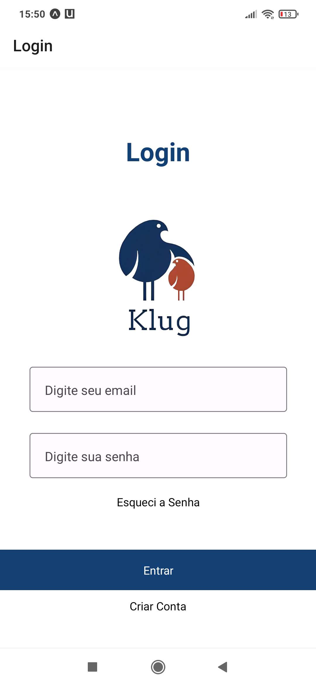

### Tentativa de Login com senha incorreta.

>

### Redefinição de senha
>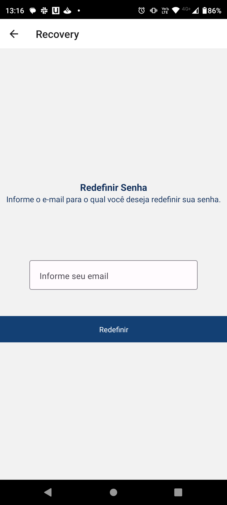

### Tentativa com login e senha corretos - Página Home

>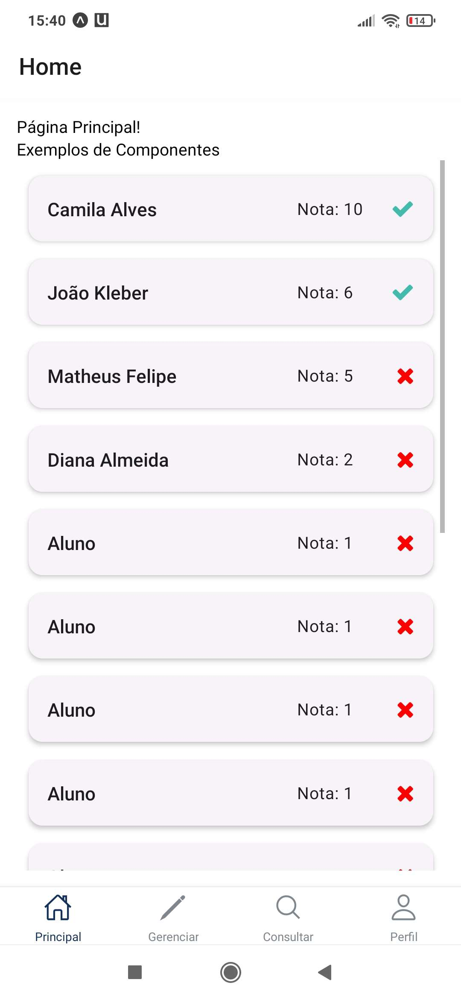

### Botão das páginas - Entrar, Cadastrar e Recuperar Senha
A área azul indica que o botão é daquele tamanho, porém, a área funcional dele é somente o centro (como é mostrado na imagem). Os botões estão funcionais, mas ainda é necessário corrigir isso no layout. 
>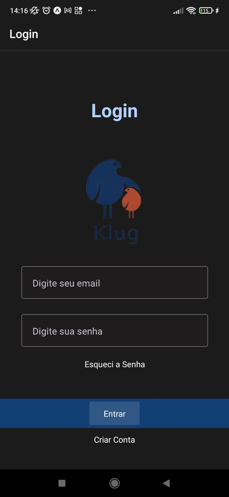

### CT-02 – Home page com estatística do aluno
>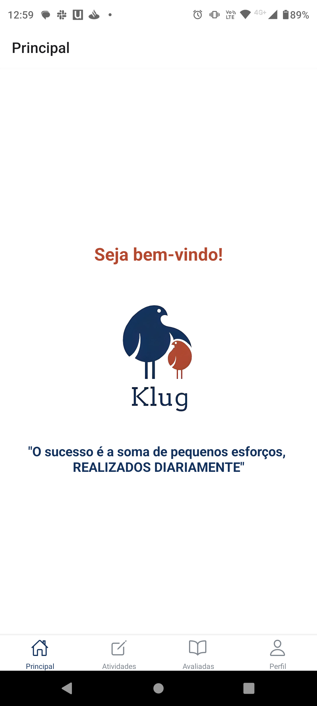
>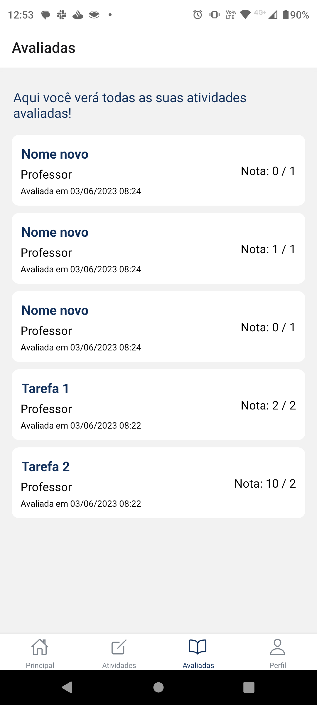

### CT-03 – Home page com estatística dos alunos
>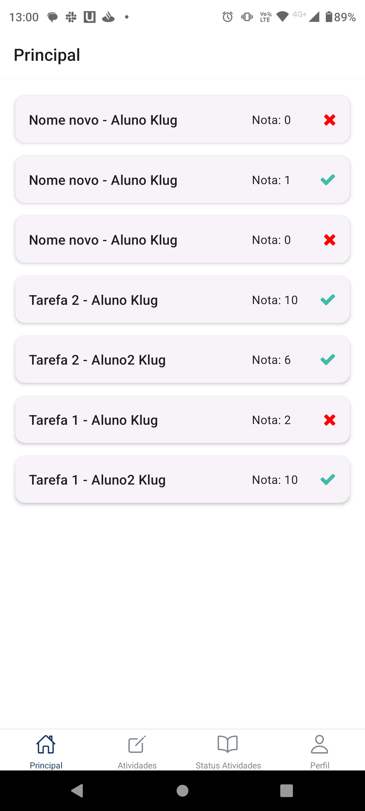

### CT-04 – Menu lateral com as matérias disponíveis
>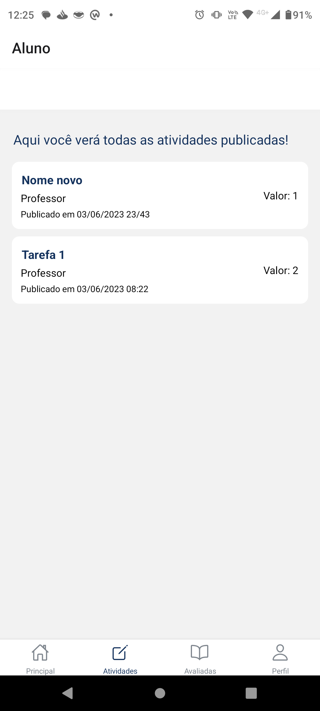
>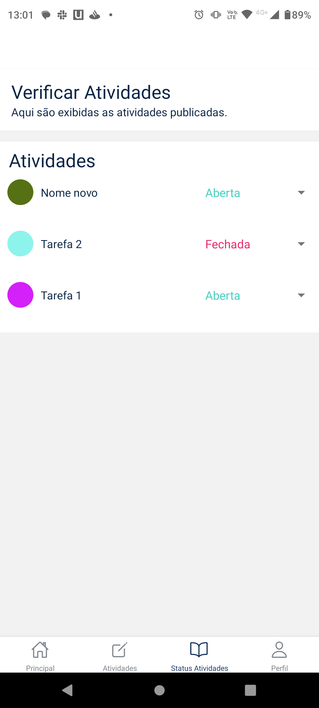

### CT-05 – Scroll com as Questões de Multipla Escolha
>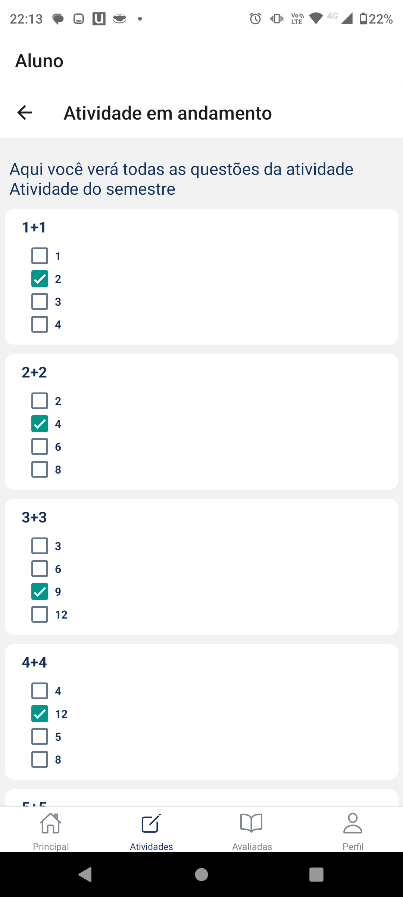
>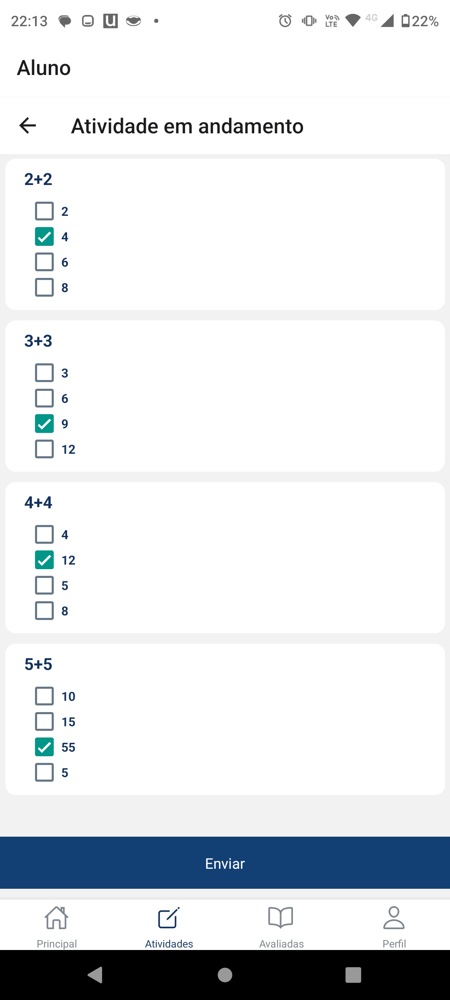

### CT-06 – Feedback da Resposta da Questão
>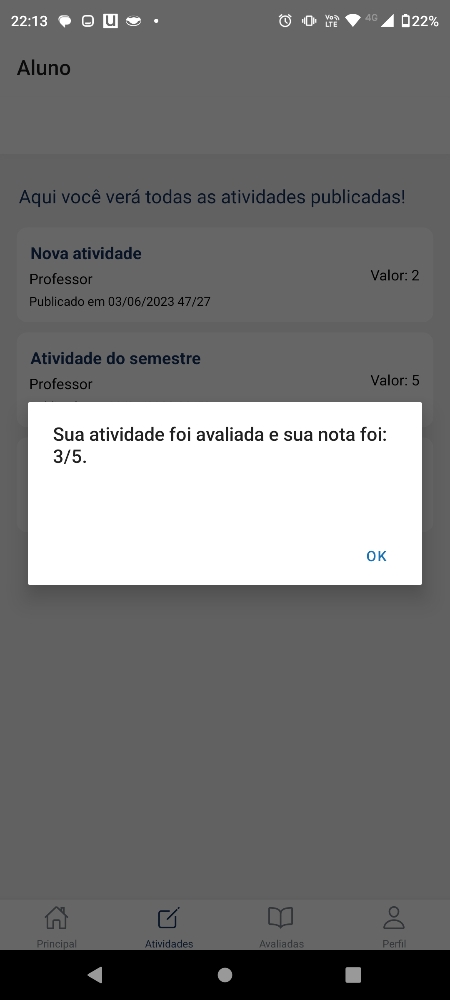

### CT-07 – CRUD Questões para Professores
>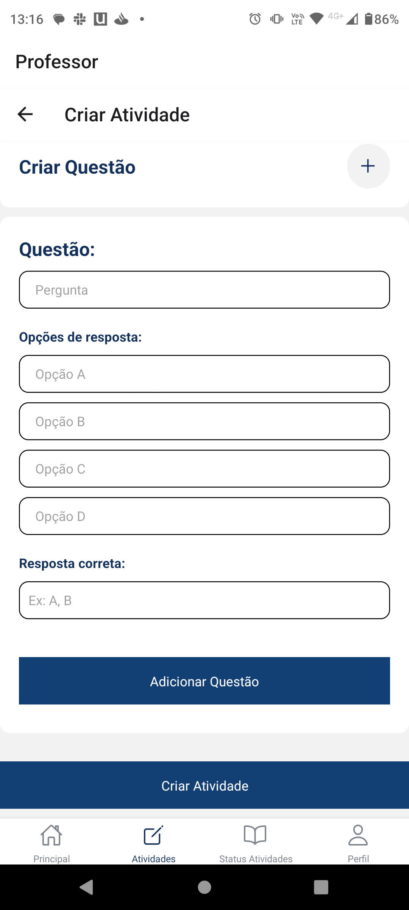
>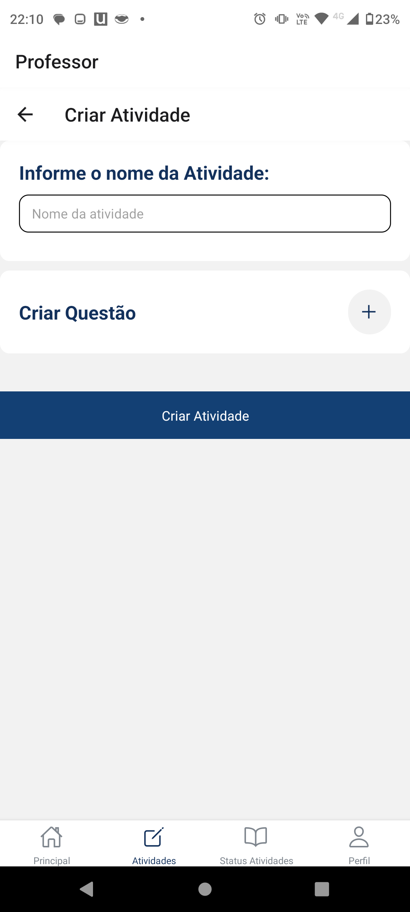
>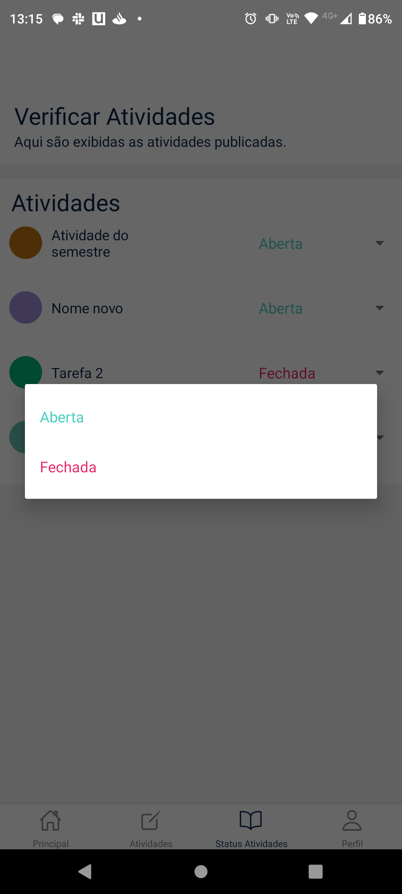

### CT-08 – Envio das Questões para Alunos
>
>

# Avaliação

## CT-01 – Tela de login

O usuário agora pode acessar o aplicativo ao inserir o email e a senha previamente cadastrados. Além disso, se o usuário esquecer a senha, é possível recuperá-la por meio da tela dedicada a esse fim, onde ele pode inserir seu endereço de email cadastrado. No entanto, ainda não é possível enviar uma nova senha automaticamente para o email cadastrado. Essa funcionalidade será adicionada em uma futura atualização do aplicativo, a fim de fornecer uma melhor experiência ao usuário.

## CT-02 – Home page com estatística do aluno
Para a expêriência do aluno, a equipe decidiu separar as páginas home das tarefas avaliadas. Assim, suas estatísticas ficam agora em uma tela separada.

## CT-03 – Home page com estatística dos alunos
Logo que o professor entra no aplicativo, mostram as notas que os alunos tiraram nas atividades.

## CT-04 – Menu lateral com as matérias disponíveis
O menu lateral deixou de existir em uma evolução pensada pela equipe. O menu de navegação fica no canto inferior e por ela o aluno consegue acessar as atividades que foram publicadas pelo professor. Assim como o professor consegue acessar as atividades que estão abertas ou fechadas.

### CT-05 – Scroll com as Questões de Multipla Escolha
O aluno consegue ver todas as questões da atividade. 

### CT-06 – Feedback da Resposta da Questão
Assim que o aluno confirma o envio, ele recebe sua nota.

### CT-07 – CRUD Questões para Professores
O professor consegue criar as atividades, as questões e alterar o status delas para aberto ou fechado. 

### CT-08 – Envio das Questões para Alunos
O botão de envio das questões aparece corretamente.
